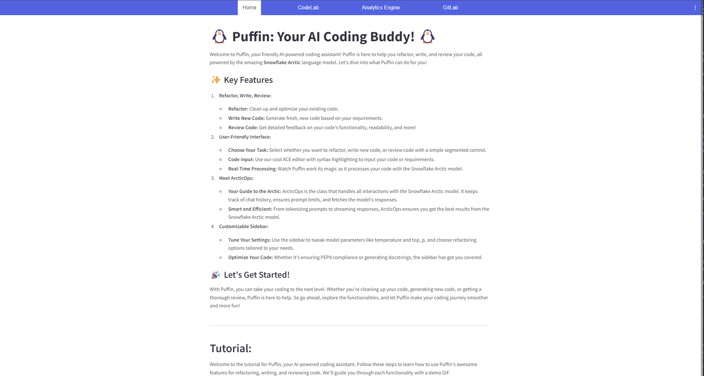
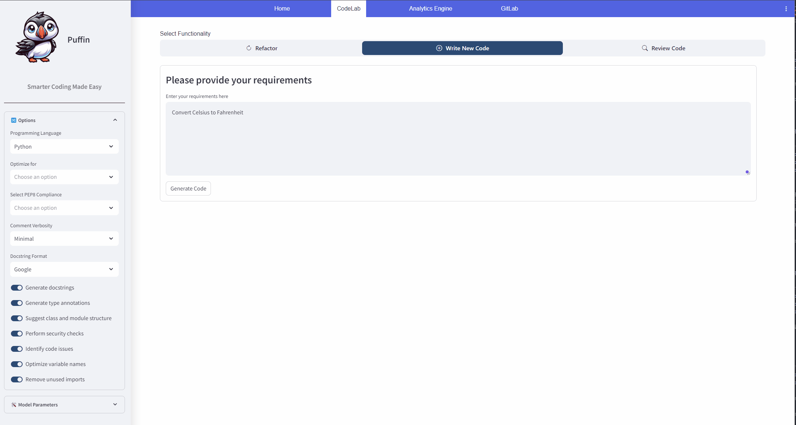
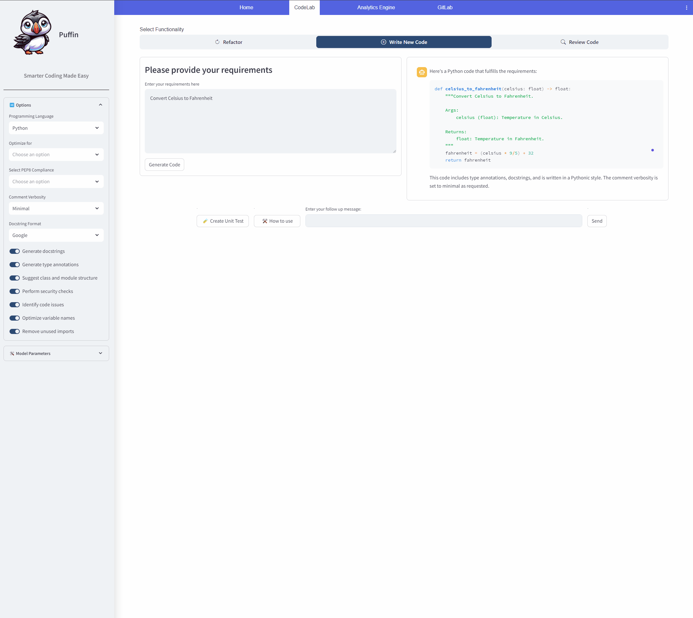
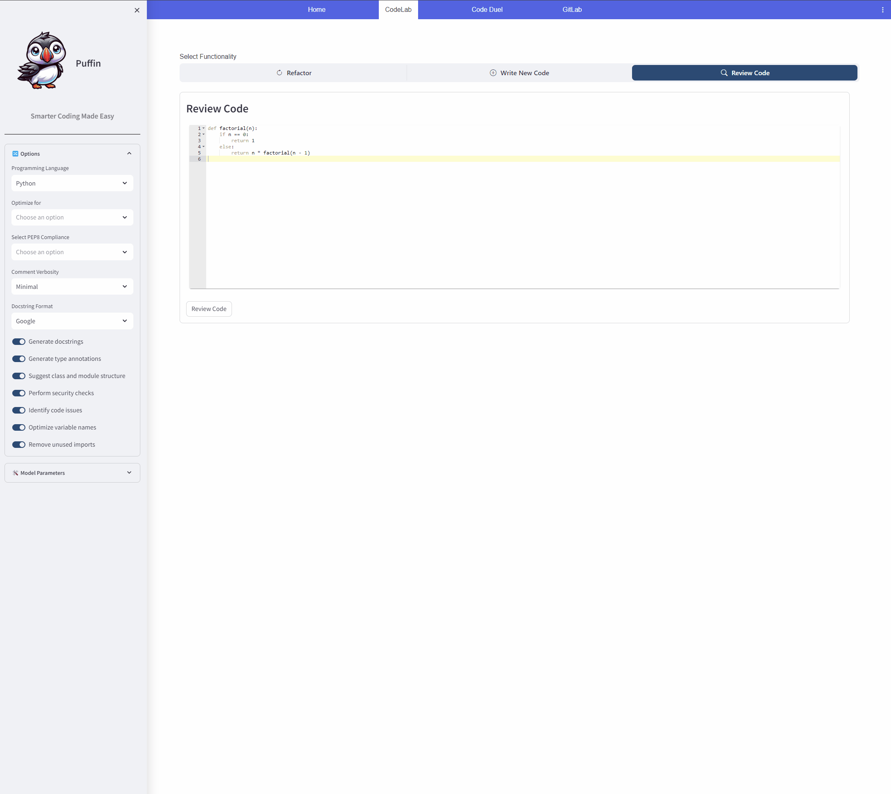

# Table of Content
<!-- vscode-markdown-toc -->
* 1. [✨ Key Features](#KeyFeatures)
* 2. [Options and Functionalities](#OptionsandFunctionalities)
	* 2.1. [Code Refactoring, Writing, and Reviewing](#CodeRefactoringWritingandReviewing)
* 3. [🎉 Let's Get Started!](#LetsGetStarted)
	* 3.1. [:film_projector: Tutorials:](#film_projector:Tutorials:)
	* 3.2. [🎨 Step 1: Choose Your Task](#Step1:ChooseYourTask)
		* 3.2.1. [Demo - Choosing Your Task:](#Demo-ChoosingYourTask:)
	* 3.3. [📝 Step 2: Input Your Code or Requirements](#Step2:InputYourCodeorRequirements)
		* 3.3.1. [Demo: Inputting Code/Requirements](#Demo:InputtingCodeRequirements)
	* 3.4. [⚙️ Step 3: Configure Options](#Step3:ConfigureOptions)
	* 3.5. [🚀 Step 4: Process Your Code](#Step4:ProcessYourCode)
		* 3.5.1. [Demo: Configuring Options and Generate/Refactor/Review Code](#Demo:ConfiguringOptionsandGenerateRefactorReviewCode)
	* 3.6. [📊 Step 5: View the Results](#Step5:ViewtheResults)
	* 3.7. [🔄 Step 6: Follow-Up Prompts](#Step6:Follow-UpPrompts)
		* 3.7.1. [Demo: Follow-Up Prompts](#Demo:Follow-UpPrompts)
* 4. [Examples of Puffin's Features](#ExamplesofPuffinsFeatures)
	* 4.1. [Refactor Code](#RefactorCode)
	* 4.2. [Write New Code](#WriteNewCode)
	* 4.3. [Review Code](#ReviewCode)
		* 4.3.1. [Demo: Reviewing Code](#Demo:ReviewingCode)

<!-- vscode-markdown-toc-config
	numbering=true
	autoSave=true
	/vscode-markdown-toc-config -->
<!-- /vscode-markdown-toc -->

# 🐧 Puffin: Your AI Coding Assistant! 🐧

Welcome to Puffin, your friendly AI-powered coding assistant! Puffin is here to help you refactor, write, and review your code, all powered by the amazing **Snowflake Arctic** language model. Let's dive into what Puffin can do for you!

##  1. ✨ Key Features

1. **Refactor, Write, Review:**
    - **Refactor:** Clean up and optimize your existing code.
    - **Write New Code:** Generate fresh, new code based on your requirements.
    - **Review Code:** Get detailed feedback on your code's functionality, readability, and more!

2. **User-Friendly Interface:**
    - **Choose Your Task:** Select whether you want to refactor, write new code, or review code with a simple segmented control.
    - **Code Input:** Use our cool ACE editor with syntax highlighting to input your code or requirements.
    - **Real-Time Processing:** Watch Puffin work its magic as it processes your code with the Snowflake Arctic model.

3. **Meet ArcticOps:**
    - **Your Guide to the Arctic:** ArcticOps is the class that handles all interactions with the Snowflake Arctic model. It keeps track of chat history, ensures prompt limits, and fetches the model's responses.
    - **Smart and Efficient:** From tokenizing prompts to streaming responses, ArcticOps ensures you get the best results from the Snowflake Arctic model.

4. **Customizable Sidebar:**
    - **Tune Your Settings:** Use the sidebar to tweak model parameters like temperature and top_p, and choose refactoring options tailored to your needs.
    - **Optimize Your Code:** Whether it's ensuring PEP8 compliance or generating docstrings, the sidebar has got you covered.

##  2. Options and Functionalities

###  2.1. Code Refactoring, Writing, and Reviewing

Puffin provides several options to customize your coding experience. Here are the key functionalities and options:

1. **Select Functionality:**
    - **Refactor:** Clean up and optimize your existing code.
    - **Write New Code:** Generate new code based on your requirements.
    - **Review Code:** Get feedback on your code’s quality.

2. **ACE Editor:**
    - **Code Input:** Use the ACE editor with syntax highlighting to enter your code.
    - **Requirements Input:** Describe your requirements for new code generation.

3. **Model Parameters:**
    - **Temperature:** Adjusts the creativity of the code generation.
    - **Top_p:** Controls the diversity of the generated output.

4. **Refactoring Options:**
    - **Optimize for:** Specific areas to optimize the code.
    - **PEP Compliance:** Ensure compliance with PEP standards.
    - **SQL Variant:** Choose SQL variant for SQL-related tasks.
    - **SQL Formatting:** Enforce SQL formatting rules.
    - **Autogenerate Docstrings:** Automatically generate docstrings.
    - **Include Type Annotations:** Add type annotations to the code.
    - **Identify Code Smells:** Find and fix code smells.
    - **Variable Renaming:** Optimize variable names.
    - **Code Organization:** Suggest class and module structure.
    - **Remove Unused Imports:** Clean up unused imports.
    - **Security Check:** Perform security checks.
    - **Comment Verbosity:** Set the level of comment verbosity.
    - **Pythonic Code:** Ensure the code follows Pythonic conventions.
    - **SQL Compliance:** Ensure the code is SQL-compliant.

5. **Review Criteria:**
    - **Functionality:** Check if the code works as intended.
    - **Readability:** Evaluate the readability of the code.
    - **Efficiency:** Optimize for performance.
    - **Error Handling:** Ensure proper error handling.
    - **Security:** Check for security vulnerabilities.
    - **Testing:** Verify the adequacy of testing.
    - **Best Practices:** Follow coding best practices.
    - **Documentation:** Ensure clear and complete documentation.
    - **Maintainability:** Assess the maintainability and scalability of the code.

Explore these options in Puffin to tailor the tool to your specific needs and make the most out of your coding experience!

##  3. 🎉 Let's Get Started!

With Puffin, you can take your coding to the next level. Whether you're cleaning up your code, generating new code, or getting a thorough review, Puffin is here to help. So go ahead, explore the functionalities, and let Puffin make your coding journey smoother and more fun!

###  3.1. :film_projector: Tutorials:

Welcome to the tutorial for Puffin, your AI-powered coding assistant. Follow these steps to learn how to use Puffin's awesome features for refactoring, writing, and reviewing code. We'll guide you through each functionality with a demo GIF.

###  3.2. 🎨 Step 1: Choose Your Task

First, decide what you want Puffin to do. You can choose to refactor code, write new code, or review existing code.

####  3.2.1. Demo - Choosing Your Task:

###  3.3. 📝 Step 2: Input Your Code or Requirements

Depending on the task you selected, you'll need to provide some input:
- **Refactor or Review Code:** Enter your existing code.
- **Write New Code:** Describe your requirements for the new code.

Use the ACE editor for a smooth and easy coding experience.

####  3.3.1. Demo: Inputting Code/Requirements

###  3.4. ⚙️ Step 3: Configure Options

In the sidebar, you can customize the refactoring options and model parameters. Choose your programming language, optimization criteria, and other preferences.

###  3.5. 🚀 Step 4: Process Your Code

Click the button to let Puffin process your input. Puffin will refactor, generate, or review your code using the Snowflake Arctic model.

####  3.5.1. Demo: Configuring Options and Generate/Refactor/Review Code

###  3.6. 📊 Step 5: View the Results

Puffin will display the results right in the app. You can see the refactored code, newly generated code, or detailed review of your code.

###  3.7. 🔄 Step 6: Follow-Up Prompts

If you have more questions or need further adjustments, use the follow-up prompts to continue the conversation with Puffin.

####  3.7.1. Demo: Follow-Up Prompts

---

##  4. Examples of Puffin's Features

###  4.1. Refactor Code

Let Puffin clean up and optimize your existing code. Just paste your code, and Puffin will handle the rest, making it more efficient and readable.

###  4.2. Write New Code

Describe what you need, and Puffin will generate fresh, new code for you. It’s like having a personal coder at your fingertips.

###  4.3. Review Code

Get detailed feedback on your code's functionality, readability, and more. Puffin reviews your code to ensure it meets the highest standards.

####  4.3.1. Demo: Reviewing Code
